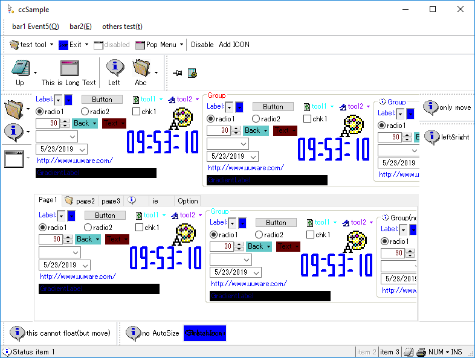
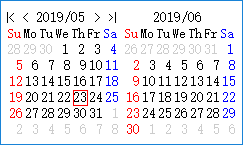
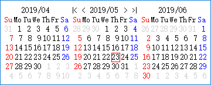
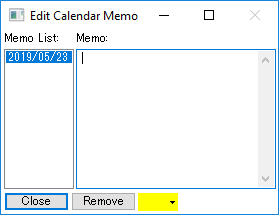
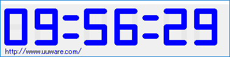
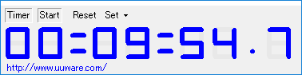
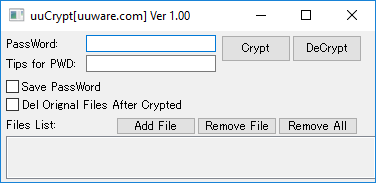
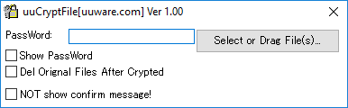
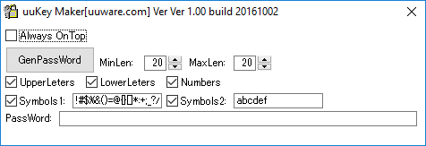
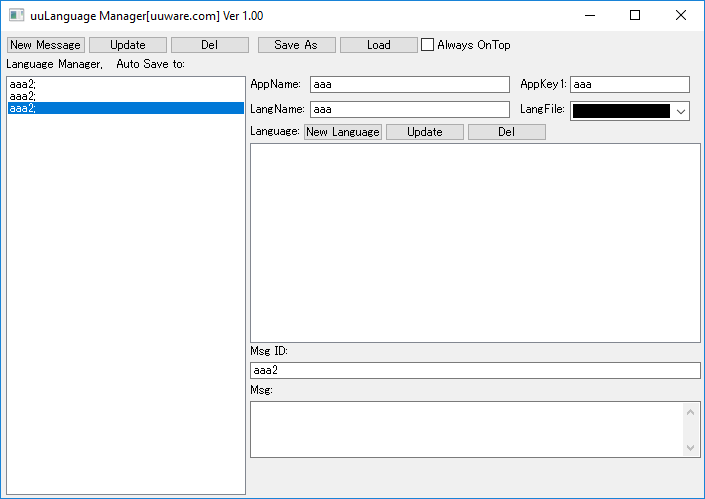

# ccProj
ccProj is a minimum C++ MFC. It is a framework for building Windows applications without 3rd run-time dll or libraries. The built release file has very small size and can run on Windows XP or even Windows NT, 98 or 95. I have maintained the project for more than 10 years and built a lot of free software with it. 
 
 
If I have time, I want to make to run on ohter platforms, like Linux and MacOS. 
 &#x1F49B;**I am looking for a job in New Zealand. Please help me:)**.&#x1F49B; 
 
 
<b>How to build it?</b> 
As I am very keen on maintaining this project through 2006 to now, there are ccProj2003.sln, ccProj2008.sln, ccProj2010.sln, ccProj2015.sln soultions included. ccProj2003.sln, ccProj2008.sln and ccProj2010.sln were used before Windows 7, and ccProj2015.sln have been used on Windows 7 but not verified on Windows 10. 
So you can use those solutions to build the applications. 
But I often use another approach - Bat, to build release files and this can work on Windows XP, 7, and 10. 
First, please download the build SDK and unzip it under C:\Temp\t\PlatformSDK or D:\Temp\t\PlatformSDK or D:\dev\t\PlatformSDK. Then at the ccSample folder, there are several Bat files. For example, if you want to build DesktopCalendar, then Double click on ~DesktopCalendar.bat, it will start to build unicode and debug release file. 
When you drop any one file onto ~DesktopCalendar.bat to start the Bat, it will build unicode and release file. 
Here are all options: 
  with 0 param for unicode and debug 
  with 1 param for unicode and release 
  with 2 param for ansi and release 
  with 3 param for ansi and debug 
  with one folder in param 1 or 2 or 3 for x64 exe file 
  with two folder in param 1 or 2 or 3 for upx exe file 
 
Here are the screen captures of some samples. This shows Menu, Toolsbar, StatusBar, Tabpage and other controls. 
Executable file:<a href="ccSample.exe">ccSample.exe</a> 
 
 
Desktop Calendar. You can choose how many months to show. You can write memo on particular days and choose color for it. 
Executable file:<a href="DesktopCalendar.exe">DesktopCalendar.exe</a> 
 
 
 
 
Time panel can be shown on desktop. 
Executable file:<a href="LedTime.exe">LedTime.exe</a> 
 
 
Timer. 
Executable file:<a href="DesktopTimer.exe">DesktopTimer.exe</a> 
 
 
Crypt files with my onw encryption algorithm. Bw careful, don't forget the password, then no anyone can help you. 
Executable file:<a href="uuCrypt.exe">uuCrypt.exe</a> 
 
Executable file:<a href="uuCryptFile.exe">uuCryptFile.exe</a> 
 
 
Generate password. 
Executable file:<a href="uuKeyGen.exe">uuKeyGen.exe</a> 
 
 
Manage language for developing software. It is only used by me, but put here for showing sample of layout. 
Executable file:<a href="uuLang.exe">uuLang.exe</a> 
 
 
 
Other samples are showing on my homepage:<a href="http://uuware.com/" target="_blank">http://uuware.com/</a>
